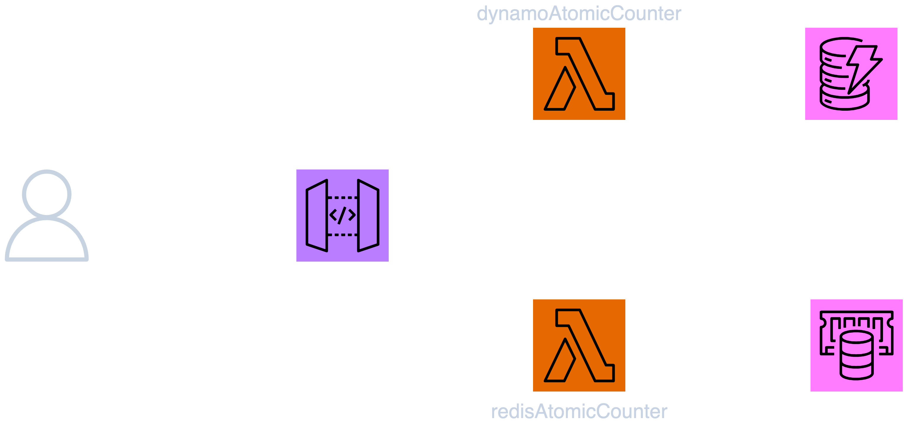

# Welcome to Atomic Counter CDK project!

This project is a simple CDK project to test the atomic counter pattern using DynamoDB and Redis, comparing the two solutions.

## The project
The scope of the project is to measure time taken by the two datastores to increment a counter. The project is composed by the following components:
- Api Gateway: it's the entry point for the events. It's a REST API that accepts POST requests to increment the counter.
- Lambda function: it's used to increment the counter in the datastores
- DynamoDB: it's used to store the counter
- ElastiCache: it's used to store the counter



## How to deploy
At the first run you need to bootstrap the CDK environment with the following command:
```bash
npx cdk bootstrap
```

Then you can deploy the stack with the following command:
```bash
npx cdk deploy
```

## How to run the project
Once the stack is deployed, you can use the API Gateway to increment the counter. 

The API Gateway exposes a POST endpoint under the `/dynamo/{id}` and `/redis/{id}` path. 

The `id` is the id of the counter you want to increment.

An usage plan and an API key are created to protect the API Gateway, so you need to provide the API key in the request header.

Here an example using curl:
```bash
curl -X POST https://<api_id>.execute-api.<region>.amazonaws.com/prod/dynamo/1 -H "x-api-key: <api_key>"
```

## How to measure the performance
You can find a cloudwatch dashboard source json called `cloudwatch-dashboard` into docs folder. 

You can import it in your AWS account to visualize the performance of the two datastores.

The stack also creates two custom metrics to visualize the value of the counter in the two datastores.

In order to produce data i used postman performance's test, sending to the two apis requests to increment the same counter from concurrent clients.

## Useful commands

* `npm run build`   compile typescript to js
* `npm run watch`   watch for changes and compile
* `npm run test`    perform the jest unit tests
* `npx cdk deploy`  deploy this stack to your default AWS account/region
* `npx cdk destroy` destroy this stack to your default AWS account/region
* `npx cdk diff`    compare deployed stack with current state
* `npx cdk synth`   emits the synthesized CloudFormation template
