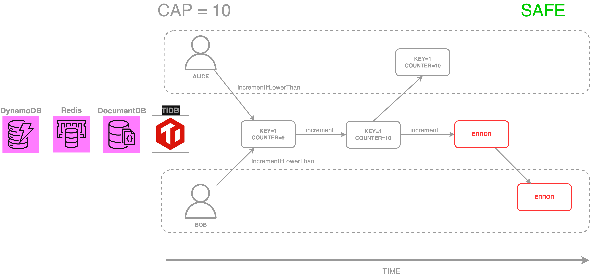
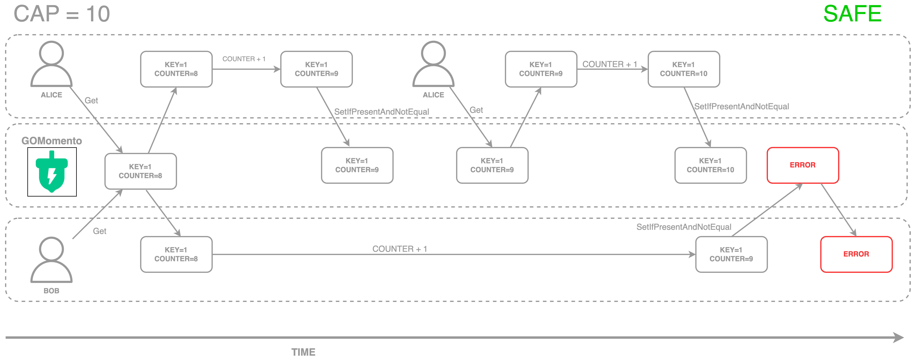
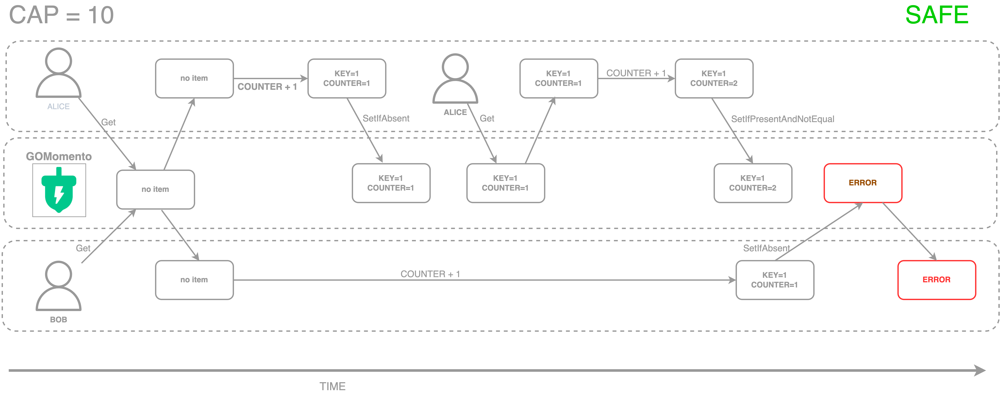
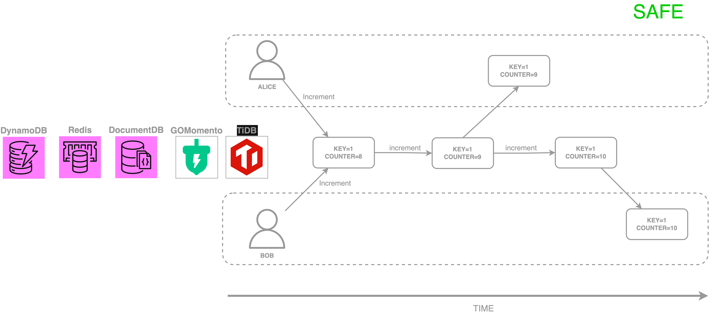
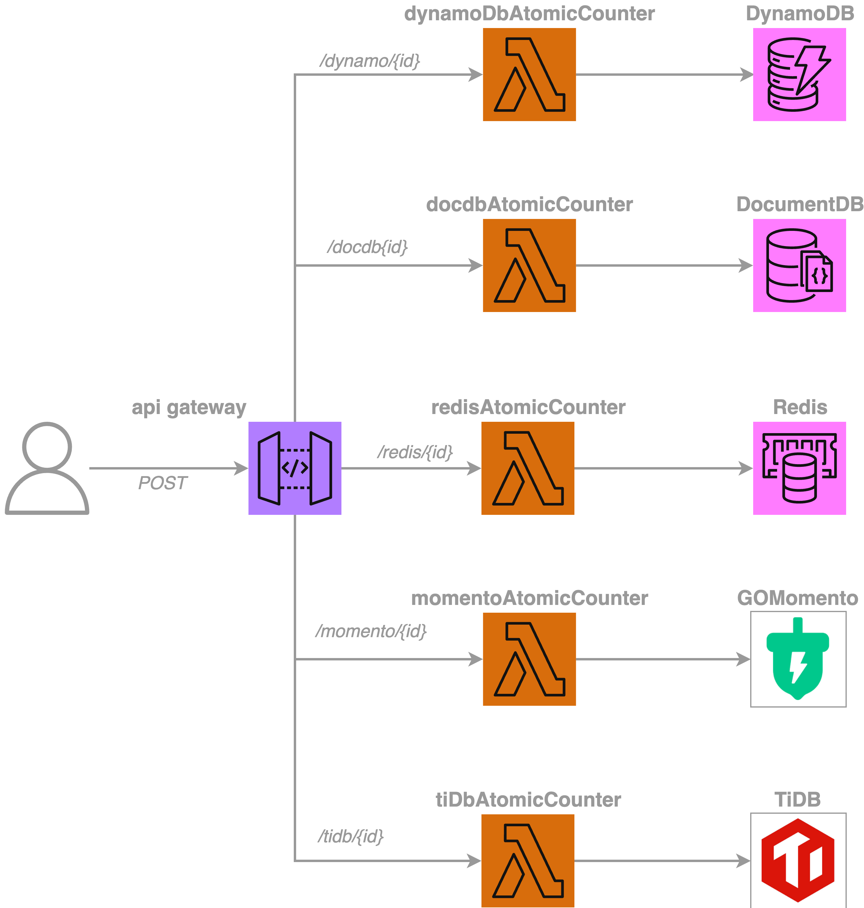

# Welcome to Atomic Counter Pattern project

This is a simple CDK project to test the atomic counter pattern against the following different distributed datastores:

- [DynamoDB](https://aws.amazon.com/dynamodb/) 
- [Elasticache - Redis](https://aws.amazon.com/redis/)
- [Momento](https://www.gomomento.com/) 
- [DocumentDB - MongoDB compatible](https://aws.amazon.com/it/documentdb/)
- [TiDB](https://pingcap.com/products/tidb/)

comparing the solutions and how different distributed storage systems can be used to implement the same pattern in a serverless environment, and how to implement it in distributed applications.

Please note that in this context the term "counter" is used to indicate a simple integer value that is incremented by one each time.

All selected datastores are distributed and have different characteristics:

- DynamoDB: NoSQL leaderless with quorum-based consistency approach (Paxos). Asynchronous replication. Eventual consistency w/ strong consistency as an option.
- Elasticache - Redis: Key-Value store with primary -> read replicas approach. Asynchronous replication. Eventual consistency.
- Momento: Key-Value, no information about consistency and replication strategy. Eventual consistency.
- DocumentDB: NoSQL leader-based with quorum-based consistency approach (Raft-inspired). Asynchronous replication. Eventual consistency.
- TiDB: Relational mysql leader-based with quorum-based consistency approach (Raft). Asynchronous replication. Strong consistency.

## Why these datastores?
The datastores have been selected because they are widely used in the industry and they have different characteristics in terms of consistency, replication and data modelling. More datastore could be added to the project, but the selected ones are enough to cover the most common scenarios.

## Atomic counter pattern
**Atomic counter** is a pattern used to increment a counter in a distributed environment, where multiple clients can increment the counter concurrently. 
Since the counter goes only up and only by one at each write, order of writes is not important.
Two flavors of the pattern are covered in this project:

- **Conditional writes** are used to ensure that the counter is incremented only if the counter stays under a certain value. In this case, the conditional write is used to check if the counter is under a certain value. If the counter is over the value, the write is rejected. A real case scenario could be a system that needs to limit the number of votes that a user can cast.

- **Unconditional writes** are used to increment the counter without checking if it is under a certain value. A real case scenario could be a system that needs to count the number of times a certain event happens, like storing a click stream.

Other scenarios could be implemented, like incrementing by different steps or decrementing the counter, but they are not covered in this project.

### Condtional writes
All the datastores used in this project support conditional writes, but in different ways: 
- Dynamo offers a way to use conditional writes using the `ConditionExpression` parameter in the `PutItem` operation. 
- Redis offers different ways to use conditional writes. In this project this is achieved executing a `LUA Script`.
- GoMomento offers a way to use conditional writes using the `setIfPresentAndNotEqual` method, but the increment is perfomed on client side. Moreover clients need to check if the counter is actually present, and if not initialize it to 1 performing a `setIfAbsent` operation. This could lead to race conditions and only one of the competing clients would be able to initialize / increment the counter. 
- DocumentDB offers conditional writes in many ways. In this project the conditional writes are implemented using the `updateOne` method, configured to perform upserts and specifying filters to check if the counter is under a certain value. In order to avoid duplicates potentially introduced by upserts, an `unique` index is used on the counter field. The index is created by a lambda function triggered by an EventBridge rule on stack creation and update.
- TiDB offers SQL transactions to perform conditional writes. In this project the conditional writes are implemented using an `INSERT INTO ON DUPLICATE KEY UPDATE` statement with an `IF` statement to check if the counter is under a certain value.

#### Dynamo, Redis, DocumentDB conditional writes
Dynamo, Redis, DocumentDB and TiDB support conditional writes on server side. The counter is incremented only if its value is under a certain value, and the write is rejected if the counter is over the value. 



#### GOMomento conditional writes
GoMomento supports conditional writes, but the counter is incremented on client side, ant this can lead to race conditions. The counter is written only if the counter is not equal to a certain value, and the write is rejected if the counter is exactly equal to the value.



This diagram shows the counter initialization process, where two clients try to initialize the counter to 1. The first client is able to initialize the counter, while the second client would fail because the counter is already present. 



### Uncondtional writes
Counter is incremented regardless of the value of the counter, the write is always accepted and order of writes is not important.



## What you'll deploy

The project is composed by the following resources:
- Api Gateway: it's the entry point for the events. It's a REST API that accepts POST requests to increment the counter.
- Lambda function: it's used to increment the counter in the datastores. It's also used to create the unique index on the counter field in DocumentDB and to setup TiDB.
- DynamoDB: it's used to store the counter. see [DynamoDB](https://aws.amazon.com/dynamodb/)
- ElastiCache: it's used to store the counter. see [Redis](https://aws.amazon.com/redis/)
- Momento: it's used to store the counter. see [Momento](https://www.gomomento.com/)
- DocumentDB: it's used to store the counter. see [DocumentDB](https://aws.amazon.com/it/documentdb/)
- TiDB: it's used to store the counter. see [TiDB](https://pingcap.com/products/tidb/)
- EventBridge: it's used to trigger the lambda function when the stack is created or updated, to create the unique index on the counter field in DocumentDB and to setup TiDB.



## How to deploy
At the first run you need to bootstrap the CDK environment with the following command:
```bash
npm cdk bootstrap
```

Then you can deploy the stack with the following command:
```bash
npm cdk deploy
```

## How to configure the project
You can configure the project by editing the `.env` file, where you can set the following variables

- `USE_CONDITIONAL_WRITES` (possible values: true, false)
- `MAX_COUNTER_VALUE` (possible values: a number)
- `MOMENTO_CACHE_NAME` (possible values: a string)

###  GoMomento setup
Momento cluster must be created from [Momento console](https://www.gomomento.com/), and you need to provide the `momento_key_info.json` file to the stack placing it in the root folder of the project.

The file must have the following structure:

```json
{
    "apiKey": "XXX",
    "refreshToken": "XXX",
    "validUntil": 123456789,
    "restEndpoint": "https://xxxx"
}
```

### DocumentDB setup
Unique index on DocumentDB is created by a lambda function triggered by an EventBridge rule on stack creation and update.

### TiDB setup
TiDB cluster must be created from [TiDb console](https://tidbcloud.com), and you need to provide the `tidb_info.json` file to the stack placing it in the root folder of the project.
The file must have the following structure:

```json
{
  "host": "XXX",
  "port": "4000",
  "user": "XXXX",
  "pwd":  "XXXX",
  "db":   "XXX"
}

```

The database, table and index are created by a lambda function triggered by an EventBridge rule on stack creation and update.

## How to run the project
Once the stack is deployed, you can use the API Gateway to increment the counter. 

The API Gateway exposes a POST endpoint under the `/dynamo/{id}`, `/redis/{id}`, `/momento/{id}`, `/docdb/{id}`, `/tidb/{id}` paths. 

The `id` is the id of the counter you want to increment.

An usage plan and an API key are created to protect the API Gateway, so you need to provide the API key in the request header.

Here an example using curl:
```bash
curl -X POST https://<api_id>.execute-api.<region>.amazonaws.com/prod/<dynamo|redis|momento|docdb|tidb>/<item_id> -H "x-api-key: <api_key>"
```

## How to test the project
`Jest` is used as testing framework, and you can run the tests with the following command:

```bash
npm run test
```

You can run coverage with the following command:

```bash
npm run coverage
```
and it will generate a coverage report in the `coverage` folder.

## How to monitor
You can find a cloudwatch dashboard source json called `cloudwatch-dashboard` into docs folder. 

The stack also creates custom metrics to visualize the sum of values of single counters in the datastores, created by metric filters on the log groups of the lambdas: the lambda functions print out the value of the counter in the logs, so you can sum up the value of the counter in the cloudwatch logs.

## Useful commands

* `npm run build`   compile typescript to js
* `npm run watch`   watch for changes and compile
* `npm run test`    perform the jest unit tests
* `npm cdk deploy`  deploy this stack to your default AWS account/region
* `npm cdk destroy` destroy this stack to your default AWS account/region
* `npm cdk diff`    compare deployed stack with current state
* `npm cdk synth`   emits the synthesized CloudFormation template


## Clean up
You can clean up the resources created on AWS by running the following command:

```bash
cdk destroy
```
please note that GoMomento and TiDb are created from their respective consoles, so cdk destroy will not delete them.


